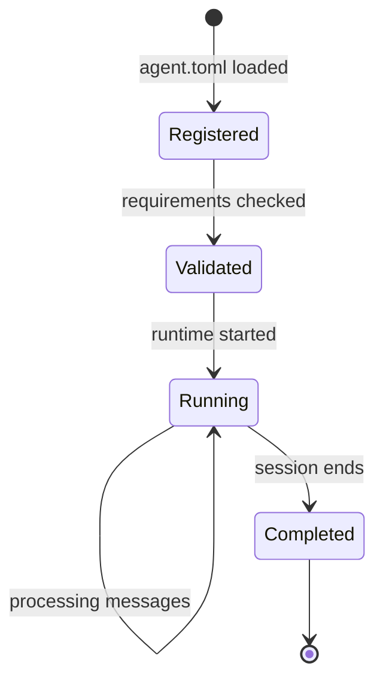

# Agents Model

Agents are VlinderCLI's core abstraction — self-contained units of AI capability that declare their requirements and run in isolation. Write them in any language, with any framework. The platform handles infrastructure, state capture, and time-travel debugging.

## What Is an Agent?

An agent is an OCI container paired with a declarative manifest ([`agent.toml`](../reference/agent-toml.md)). The manifest declares what the agent needs — models, services, storage, knowledge — and VlinderCLI provisions everything. Agent code is infrastructure-agnostic: it doesn't know whether it's running locally or in a distributed cluster.

Because every decision an agent makes flows through the platform as a typed message, the platform can capture complete state at every step. This is what makes rewind and branching possible — the agent doesn't need to do anything special.

## Lifecycle


1. **Registration** — the manifest is loaded, the agent is registered with the registry, and an Ed25519 identity key pair is provisioned
2. **Validation** — requirements are checked against the registry (models exist? services available? runtime supported?)
3. **Running** — the container starts, the REPL session activates, and the agent processes messages. Every inference call, storage write, and delegation is recorded as a DAG node.
4. **Completion** — the session ends and the final state is committed to the timeline

## Runtime Types

Agents can execute on different runtimes:

- **Container** — OCI containers via Podman (default). Any language, full isolation.
- **Lambda** — AWS Lambda functions. Same agent manifest, serverless execution.

The runtime is declared in `agent.toml` via the `runtime` field. The agent code doesn't change between runtimes.

## Delegation

In a fleet, agents can delegate work to other agents. The entry agent receives user input and can route sub-tasks to specialist agents. Delegation uses the same queue-based messaging — the delegating agent sends a `DelegateMessage` to the target agent's queue.

## Fleets

A fleet is a group of cooperating agents defined by a [`fleet.toml`](../reference/fleet-toml.md) manifest. One agent is designated as the entry point; others are available for delegation. All agents share the same registry and supervisor.

```
fleet.toml
├── agents/
│   ├── coordinator/agent.toml    ← entry point
│   ├── researcher/agent.toml
│   └── writer/agent.toml
```

## Knowledge Mounts

Agents can declare S3 buckets as read-only knowledge bases. The platform mounts them into the container at runtime via s3fs-fuse:

```toml
[requirements.mounts.knowledge]
s3 = "my-bucket/v0.1.0/"
path = "/knowledge"
```

The agent reads from `/knowledge` like a local filesystem. Mounts are read-only to prevent agents from modifying the knowledge base.

## Identity

Each agent is assigned an Ed25519 key pair at registration time. The public key is stored in the registry alongside the agent. Agents are also identified by a `ResourceId` URI (e.g., `http://127.0.0.1:9090/agents/echo-agent`) used in queue messages, registry lookups, and logging.

For container agents, the platform captures a content-addressed image digest (`sha256:...`) at registration time. This enables deterministic execution by pinning the exact image, independent of mutable tags.

## See Also

- [agent.toml reference](../reference/agent-toml.md) — manifest schema
- [fleet.toml reference](../reference/fleet-toml.md) — fleet manifest schema
- [Architecture](architecture.md) — supervisor and worker components
- [Your First Agent](../tutorials/your-first-agent.md) tutorial
