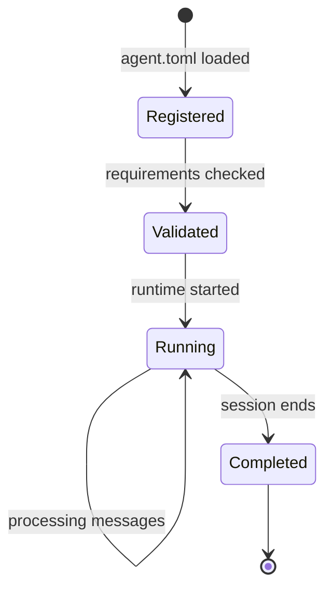

# Agents Model

Agents are VlinderCLI's core abstraction — self-contained units of AI capability that declare their requirements and run in isolated containers.

## What Is an Agent?
An agent is an OCI container paired with a declarative manifest ([`agent.toml`](../reference/agent-toml.md)). The manifest declares what the agent needs — models, services, storage — and VlinderCLI provisions everything. Agent code is infrastructure-agnostic: it doesn't know whether it's running locally or in a distributed cluster.

## Lifecycle


1. **Registration** — the manifest is loaded and the agent is registered with the registry
2. **Validation** — requirements are checked against the registry (models exist? services available? runtime supported?)
3. **Running** — the container starts, the REPL session activates, and the agent processes messages
4. **Completion** — the session ends and the final state is committed to the timeline

## Delegation
In a fleet, agents can delegate work to other agents. The entry agent receives user input and can route sub-tasks to specialist agents. Delegation uses the same queue-based messaging — the delegating agent sends an `InvokeMessage` to the target agent's queue.

## Fleets
A fleet is a group of cooperating agents defined by a [`fleet.toml`](../reference/fleet-toml.md) manifest. One agent is designated as the entry point; others are available for delegation. All agents share the same registry and supervisor.

```
fleet.toml
├── agents/
│   ├── coordinator/agent.toml    ← entry point
│   ├── researcher/agent.toml
│   └── writer/agent.toml
```

## Resource Identification
Every agent is identified by a `ResourceId` URI (e.g., `http://127.0.0.1:9090/agents/echo-agent`). This URI is used in queue messages, registry lookups, and logging.

## See Also

- [agent.toml reference](../reference/agent-toml.md) — manifest schema
- [fleet.toml reference](../reference/fleet-toml.md) — fleet manifest schema
- [Architecture](architecture.md) — supervisor and worker components
- [Your First Agent](../tutorials/your-first-agent.md) tutorial
