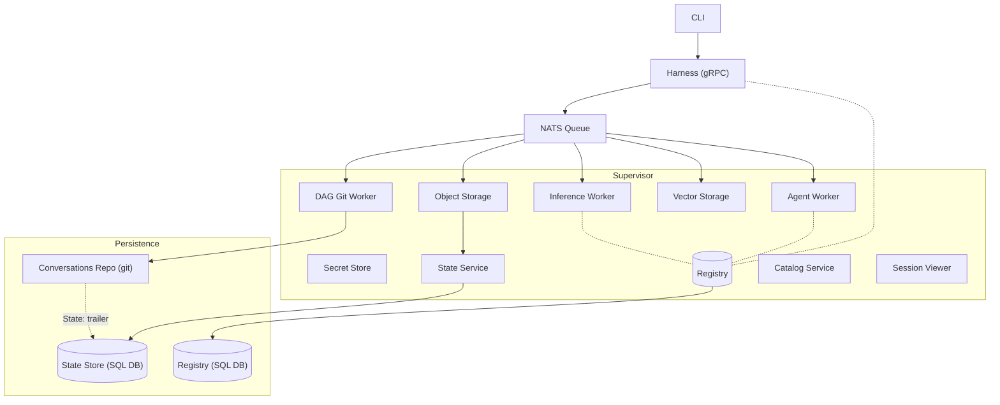
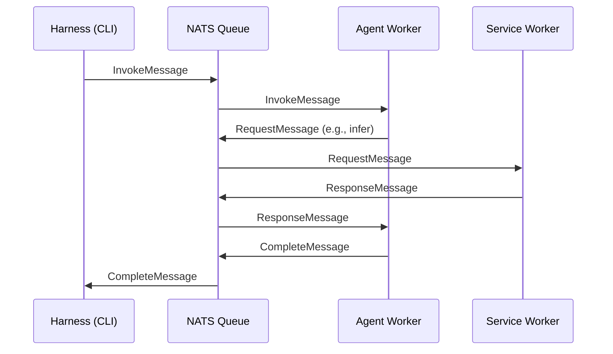

# Architecture

When an AI agent fails, you need to rewind to the failure, understand what happened, and try again. That requires capturing every decision the agent made — every inference call, every storage write, every delegation — as an immutable, content-addressed record.

VlinderCLI's architecture is shaped by this requirement. Every component communicates through typed messages over a NATS queue. Every message is recorded as a node in a content-addressed DAG. Because the full history is preserved and every state is addressable, the platform can rewind to any point, fork a timeline, and replay from there.

## Component Overview



## Supervisor

The Supervisor is the process manager. It reads the worker configuration, spawns each worker as a child process, and monitors their lifecycle. It has no domain logic — it's purely concerned with starting, stopping, and restarting workers.

The startup sequence is ordered by dependency:

1. **Secret** — starts first. The registry needs secrets for agent identity (Ed25519 keys).
2. **Registry** — starts next. All other workers connect to it via gRPC. The Supervisor waits for a health check before proceeding. If the registry fails to start within 10 seconds, the Supervisor aborts.
3. **State** — gRPC server for DAG and state queries.
4. **Catalog** — gRPC server for model catalog queries (Ollama, OpenRouter).
5. **Harness** — gRPC bridge between CLI and daemon. The Supervisor waits for a health check before proceeding. If the harness fails to start within 10 seconds, the Supervisor aborts.
6. **Remaining workers** — agent runtimes, inference, storage, DAG git, session viewer. These scale independently via config.

## Workers

Each worker is the same `vlinderd` binary, launched with a `VLINDER_WORKER_ROLE` environment variable that determines its behavior. Workers are self-contained — each independently loads config and connects to NATS and the gRPC registry.

### Worker Types

| Worker | Role | Description |
|--------|------|-------------|
| Secret | `secret` | gRPC server for agent identity (Ed25519 key pairs) |
| Registry | `registry` | gRPC server (port 9090). Source of truth for agents, models, jobs, and capabilities |
| State | `state` | gRPC server for versioned agent state (DAG nodes, state commits) |
| Catalog | `catalog` | gRPC server for model catalog queries (Ollama, OpenRouter) |
| Harness | `harness` | gRPC bridge (port 9091) for CLI→daemon agent invocation |
| Agent Container | `agent-container` | Executes OCI container agents via Podman |
| Agent Lambda | `agent-lambda` | Executes agents as AWS Lambda functions |
| Inference (Ollama) | `inference-ollama` | Local LLM inference via Ollama |
| Inference (OpenRouter) | `inference-openrouter` | Cloud LLM inference via OpenRouter API |
| Object Storage | `storage-object-sqlite` | Key-value storage backed by SQLite |
| Vector Storage | `storage-vector-sqlite` | Similarity search backed by sqlite-vec |
| DAG Git | `dag-git` | Writes messages to the conversations git repo (singleton recommended) |
| Session Viewer | `session-viewer` | HTTP server for browsing conversation history |

### Worker Configuration

Control how many instances of each worker to spawn:

```toml
[distributed.workers]
registry = 1
harness = 1
dag_git = 1
session_viewer = 1

[distributed.workers.agent]
container = 1
lambda = 0

[distributed.workers.inference]
ollama = 1
openrouter = 0

[distributed.workers.storage.object]
sqlite = 1

[distributed.workers.storage.vector]
sqlite = 1
```

Each worker type scales independently. Setting a count to 0 disables that worker type — useful for multi-node deployments where different nodes handle different services.


## Registry

The Registry worker runs a gRPC server that acts as the source of truth for all system state — agents, models, jobs, runtimes, storage backends, and inference engines. All other workers are gRPC clients.

Backed by a SQL database for persistence. State survives restarts.

## Message Flow

All inter-worker communication flows through NATS:



## Key Design Properties

- **Shared nothing** — workers don't share memory. All communication is via NATS and the gRPC registry.
- **Self-contained** — each worker independently loads config and connects to shared services, making them independently deployable across nodes.
- **Registry-driven** — capability discovery happens via the registry, not configuration. Workers register what they support; agents declare what they need.
- **Infrastructure-agnostic agents** — the same `agent.toml` works regardless of how workers are deployed.

## Storage

Rewind and fork only work if the platform can resolve the agent's exact state at any point in its history. This is why all state is content-addressed and append-only — nothing is overwritten, so every historical state remains addressable.

The primary store is the **State Store** — a content-addressed, append-only SQL database that records every message as a DAG node and every agent state transition as a versioned snapshot. Given any point in the agent's history, the platform can resolve the exact KV state, inference calls, and delegation results at that moment.

| Store | Backend | What it records | Location |
|-------|---------|----------------|----------|
| [State Store](state-store.md) | SQL | DAG nodes (every message), versioned KV state (values, snapshots, state commits) | Configurable |
| [Conversations Repository](conversations-repo.md) | Git | Projection of messages as git commits | `~/.vlinder/conversations/` |

The [Conversations Repository](conversations-repo.md) is a **read-only projection**, not a source of truth. The DAG Git worker tails the NATS message stream and writes each message as a git commit. This gives you `git log`, `git diff`, and standard git tooling for free — but the authoritative data lives in the SQL database.

## See Also

- [Queue System](queue-system.md) — message types and NATS subject routing
- [Agents Model](agents-model.md) — agent lifecycle and delegation
- [State Store](state-store.md) — versioned agent state
- [Domain Model](domain-model.md) — core types and traits
- [Distributed Deployment](../how-to/distributed-deployment.md) — multi-node setup
