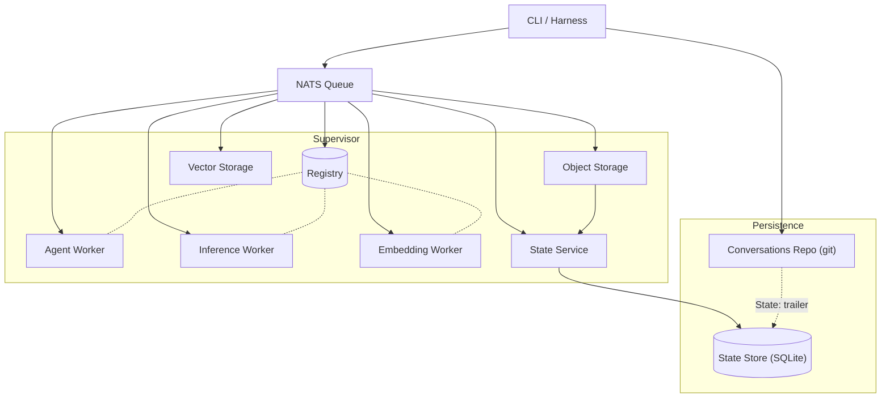
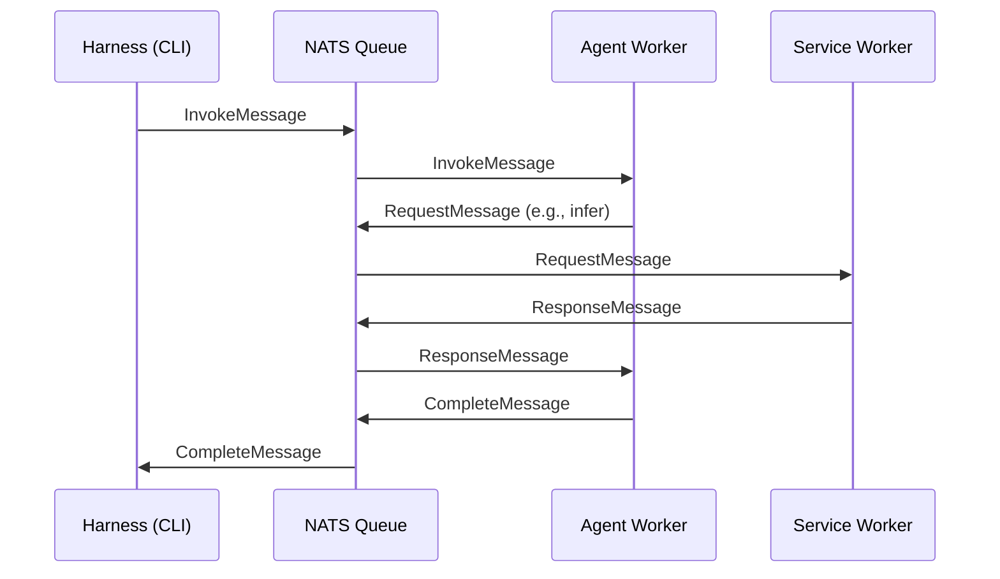

# Architecture

VlinderCLI follows a protocol-first, queue-based architecture where every component communicates through typed messages over NATS. The Supervisor spawns isolated worker processes that each handle a specific service.

## Component Overview



## Supervisor

The Supervisor is the process manager. It reads the worker configuration, spawns each worker as a child process, and monitors their lifecycle. It has no domain logic — it's purely concerned with starting, stopping, and restarting workers.

The Supervisor starts the Registry worker first and waits for it to become healthy before spawning the remaining workers. This ensures all workers can connect to the registry on startup.

It also runs a Session Viewer HTTP server on port 7777 for inspecting conversation history.

## Workers

Each worker is the same `vlinder daemon` binary, launched with a `VLINDER_WORKER_ROLE` environment variable that determines its behavior. Workers are self-contained — each independently loads config and connects to NATS and the gRPC registry.

### Worker Types

| Worker | Role | Description |
|--------|------|-------------|
| Registry | `registry` | gRPC server (port 9090). Source of truth for agents, models, jobs, and capabilities |
| Agent Container | `agent-container` | Executes OCI container agents via Podman |
| Inference (Ollama) | `inference-ollama` | Local LLM inference via Ollama |
| Inference (OpenRouter) | `inference-openrouter` | Cloud LLM inference via OpenRouter API |
| Embedding (Ollama) | `embedding-ollama` | Vector embeddings via Ollama |
| Object Storage | `storage-object-sqlite` | Key-value storage backed by SQLite |
| Vector Storage | `storage-vector-sqlite` | Similarity search backed by sqlite-vec |
| State | `state` | gRPC server for versioned agent state (DAG nodes, state commits) |

### Worker Configuration

Control how many instances of each worker to spawn:

```toml
[distributed.workers]
registry = 1
state = 1

[distributed.workers.agent]
container = 1

[distributed.workers.inference]
ollama = 2
openrouter = 1

[distributed.workers.embedding]
ollama = 1

[distributed.workers.storage.object]
sqlite = 1

[distributed.workers.storage.vector]
sqlite = 1
```

Each worker type scales independently. Setting a count to 0 disables that worker type — useful for multi-node deployments where different nodes handle different services.

## Registry

The Registry worker runs a gRPC server that acts as the source of truth for all system state — agents, models, jobs, runtimes, storage backends, and inference engines. All other workers are gRPC clients.

Backed by SQLite for persistence. State survives restarts.

## Message Flow

All inter-worker communication flows through NATS:



## Key Design Properties

- **Shared nothing** — workers don't share memory. All communication is via NATS and the gRPC registry.
- **Self-contained** — each worker independently loads config and connects to shared services, making them independently deployable across nodes.
- **Registry-driven** — capability discovery happens via the registry, not configuration. Workers register what they support; agents declare what they need.
- **Infrastructure-agnostic agents** — the same `agent.toml` works regardless of how workers are deployed.

## Two-Store Model

VlinderCLI uses two complementary stores that together enable time-travel debugging:

| Store | Backend | What it records | Location |
|-------|---------|----------------|----------|
| [Conversations Repository](conversations-repo.md) | Git | Every message (invoke, complete) as a commit | `~/.vlinder/conversations/` |
| [State Store](state-store.md) | SQLite | Versioned KV state (values, snapshots, state commits) | Sibling of agent's `data.db` |

The two stores are linked by the `State:` trailer on complete message commits. This trailer contains a state commit hash that points into the State Store's SQLite tables. Given any point in the conversation history, the platform can resolve the agent's exact KV state at that moment.

The Object Storage worker writes to both stores on every `kv_put` — the ObjectStorage backend for current-state access, and the State Store for versioned history. Reads resolve through the State Store when a state hash is provided, falling back to the ObjectStorage backend for unversioned reads.

## See Also

- [Queue System](queue-system.md) — message types and NATS subject routing
- [Agents Model](agents-model.md) — agent lifecycle and delegation
- [State Store](state-store.md) — versioned agent state in SQLite
- [Domain Model](domain-model.md) — core types and traits
- [Distributed Deployment](../how-to/distributed-deployment.md) — multi-node setup
