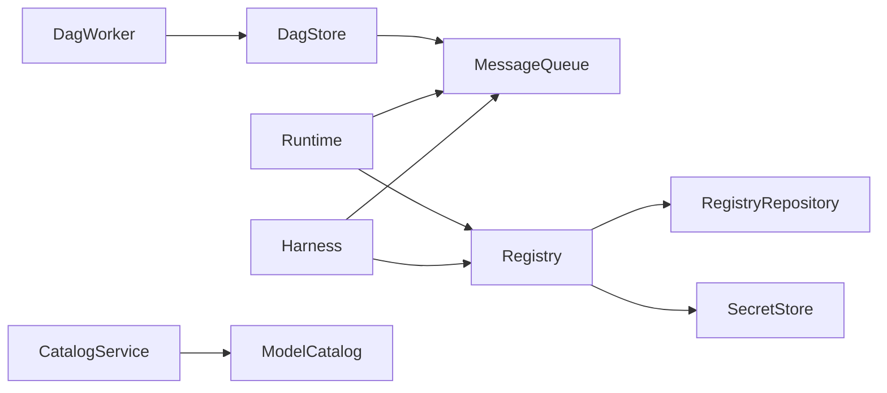

# Domain Model

VlinderCLI's domain model is the set of types and traits that define the protocol. Everything — messages, routing, storage, execution — is expressed as domain types. Infrastructure (NATS, Podman, SQL) implements these traits but never leaks into the protocol.

This separation is what makes time travel possible: because every operation flows through typed traits, the platform can record, replay, and repair any interaction without agent cooperation.

## Core Types

### Identity Types

| Type | Description | Example |
|------|-------------|---------|
| `ResourceId` | URI-based identifier for any system resource | `http://127.0.0.1:9090/agents/echo-agent` |
| `AgentId` | Agent name used for queue routing | `echo-agent` |
| `SessionId` | Conversation grouping | `ses-{uuid}` |
| `SubmissionId` | Content-addressed hash of a user request | `SHA-256(payload \|\| session \|\| parent)` |
| `TimelineId` | Branch identifier for timeline-scoped messaging | `main`, `repair-2026-03-11` |
| `Sequence` | Ordering of service interactions within a submission | `0`, `1`, `2` |

`SubmissionId` is deterministic — the same input, session, and parent always produce the same hash. This enables replay: given the same inputs, the submission chain is identical.

### Job

A unit of work submitted to an agent.

| Field | Type | Description |
|-------|------|-------------|
| `id` | `JobId` | Format: `<registry_id>/jobs/<uuid>` |
| `agent_id` | `ResourceId` | The agent that will process this job |
| `input` | `String` | The user's input text |
| `submission_id` | `SubmissionId` | Links to DAG node |
| `status` | `JobStatus` | Current state |

**Job status progression:**

```
Pending → Running → Completed(String) | Failed(String)
```

### DagNode

One node per message in the content-addressed DAG.

| Field | Description |
|-------|-------------|
| `hash` | `SHA-256(payload \|\| parent_hash \|\| message_type \|\| diagnostics \|\| session_id)` |
| `parent_hash` | Previous node in the chain (empty for session roots) |
| `message_type` | invoke, request, response, complete, delegate, repair, fork |
| `session_id` | Which conversation this belongs to |
| `submission_id` | Which user request triggered this |
| `payload` | Message content (base64-encoded bytes) |
| `state` | Agent state hash at this point |
| `checkpoint` | Checkpoint handler name (for repair) |
| `operation` | Service operation (for request/response nodes) |

### RoutingKey

Structural enum that encodes message direction and routing dimensions. Used by the queue to route messages to the correct consumer without string parsing.

Variants: `Invoke`, `Request`, `Response`, `Complete`, `Delegate`, `DelegateReply`, `Repair`, `Fork`.

### ServiceBackend and Operation

`ServiceBackend` is a typed enum that pairs a service category with its backend:

- `Kv(ObjectStorageType)` — key-value storage
- `Vec(VectorStorageType)` — vector similarity search
- `Infer(InferenceBackendType)` — text generation
- `Embed(EmbeddingBackendType)` — embedding generation

`Operation` defines what to do: `Get`, `Put`, `List`, `Delete` (KV); `Store`, `Search`, `Delete` (Vec); `Run`, `Chat`, `Generate` (Infer/Embed).

Invalid combinations (e.g., KV + Ollama) are unrepresentable in the type system.

## Core Traits

### MessageQueue

Abstract interface for all inter-component communication. Typed send/receive methods for each message type, plus request-reply facades.

| Method | Direction | Description |
|--------|-----------|-------------|
| `send_invoke` / `receive_invoke` | Harness → Runtime | Submit user input |
| `send_request` / `receive_request` | Runtime → Service | Agent calls a service |
| `send_response` / `receive_response` | Service → Runtime | Service returns result |
| `send_complete` / `receive_complete` | Runtime → Harness | Agent finishes |
| `send_delegate` / `receive_delegate` | Agent → Agent | Fleet delegation |
| `send_repair` / `receive_repair` | Platform → Sidecar | Replay a failed service call |
| `send_fork` | CLI → Platform | Create a timeline branch |
| `run_agent` | Facade | Send invoke, block until complete |
| `call_service` | Facade | Send request, block until response |
| `repair_agent` | Facade | Send repair, block until complete |

### Registry

Source of truth for all system state — agents, models, jobs, runtimes, capabilities.

### RegistryRepository

Storage layer beneath the Registry. Abstracts the database — implementations can use any SQL backend.

### Harness

API surface for external interaction. `CoreHarness` is the canonical implementation.

Key operations: `run_agent`, `repair_agent`, `fork_timeline`, `start_session`, `set_timeline`, `set_initial_state`.

The harness manages session state, Merkle-chained submissions (each submission parents the next), and timeline sealing (sealed timelines reject new invocations).

### Runtime

Agent execution orchestrator. Implementations: `ContainerRuntime` (Podman), `LambdaRuntime` (AWS).

### DagStore

Persistence layer for the content-addressed DAG. Insert nodes, query by session/submission, resolve state at any point.

### DagWorker

Observes messages and projects them into a secondary store. The git DAG worker writes each message as a git commit for browsing with standard tools.

### SecretStore

Agent identity management — stores and retrieves Ed25519 key pairs.

### CatalogService

Aggregates model catalogs (Ollama, OpenRouter) for browsing and adding models.

## Relationships



## See Also

- [Architecture](architecture.md) — how components fit together
- [Queue System](queue-system.md) — message types and flow
- [Agents Model](agents-model.md) — agent lifecycle
