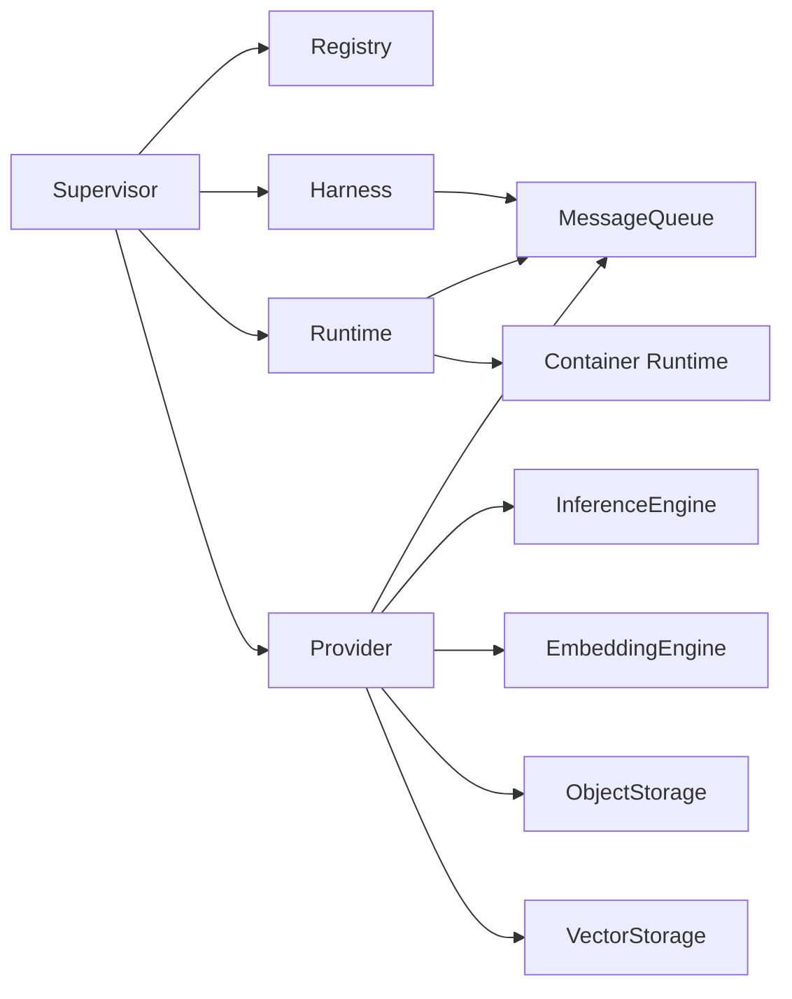

# Domain Model

This page describes VlinderCLI's core types, traits, and their relationships.

## Core Types

### ResourceId
A URI-based unique identifier for all system resources.

| Example | Resource |
|---------|----------|
| `http://127.0.0.1:9090/agents/echo-agent` | Agent |
| `http://127.0.0.1:9090/models/phi3` | Model |
| `http://127.0.0.1:9090/jobs/abc-123` | Job |
| `ollama://localhost:11434/phi3` | Model path |
| `sqlite:///path/to/objects.db` | Storage backend |

### Job
A unit of work submitted to an agent.

| Field | Type | Description |
|-------|------|-------------|
| `id` | `JobId` | Format: `<registry_id>/jobs/<uuid>` |
| `agent_id` | `ResourceId` | The agent that will process this job |
| `input` | `String` | The user's input text |
| `submission_id` | `SubmissionId` | Links to timeline commit |
| `status` | `JobStatus` | Current state |

**Job status progression:**

```
Pending → Running → Completed(String) | Failed(String)
```

### SessionId

A conversation identifier grouping multiple submissions. Format: `ses-{uuid}`.

### SubmissionId

A unique identifier for each user request. In session mode, this is the git commit SHA in the timeline repository.

### Sequence

Ordering of service interactions within a submission. Enables deterministic replay.

## Core Traits

### MessageQueue
Abstract interface for all inter-component communication.

| Method | Description |
|--------|-------------|
| `send_invoke` | Submit user input to an agent |
| `send_request` | Agent requests a service |
| `send_response` | Service returns a result |
| `send_complete` | Agent finishes processing |
| `send_delegate` | Agent delegates to another agent |

**Implementation:** `NatsQueue`

### Registry
Source of truth for all system state.

**Implementations:** `PersistentRegistry` (SQLite), `GrpcRegistryClient`

### Harness
API surface for external interaction.

**Implementations:** `CliHarness`

### Runtime
Agent execution orchestrator.

**Implementations:** `ContainerRuntime` (OCI/Podman)

### InferenceEngine
Text generation interface.

**Implementations:** Ollama, OpenRouter

### EmbeddingEngine
Vector embedding generation interface.

**Implementations:** Ollama

### ObjectStorage
Key-value storage interface.

**Implementation:** `SqliteObjectStorage`

### VectorStorage
Vector similarity search interface.

**Implementation:** `SqliteVecStorage`

## Relationships



## See Also

- [Architecture](architecture.md) — how components fit together
- [Queue System](queue-system.md) — message types and flow
- [Agents Model](agents-model.md) — agent lifecycle
