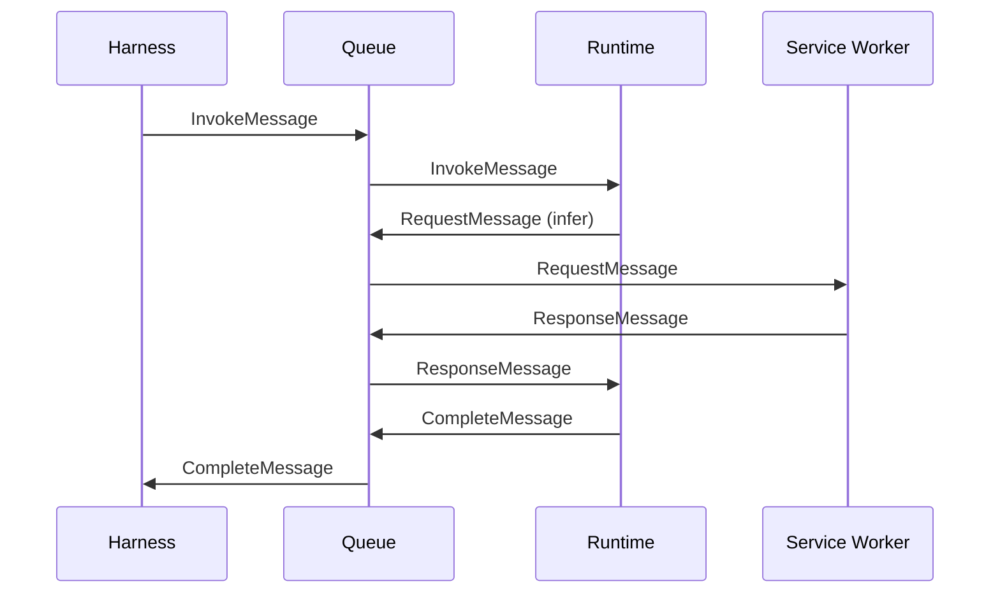
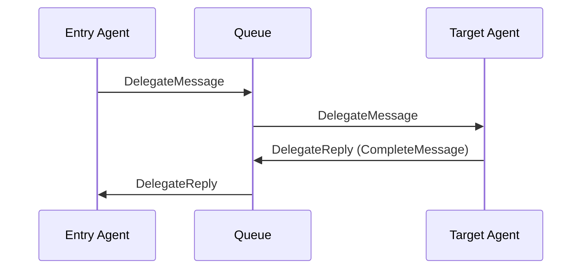

# Queue System

Every decision an agent makes — every inference call, storage write, and delegation — flows through a message queue as a typed message. This is what makes time travel possible: because the queue is the single communication layer, the platform can record and replay any interaction without agent cooperation.

## Why Queues?

Queues decouple producers from consumers. An agent doesn't know whether inference runs locally via Ollama or remotely via OpenRouter — it sends a typed message and gets a typed response. This abstraction lets VlinderCLI scale from a single process to a distributed cluster without modifying agent code.

More importantly, queues make the platform's rewind and fork capabilities possible. Because every interaction is a discrete message, the platform can intercept, record, and replay any of them.

## Message Types

The protocol defines six typed messages:

| Message | Direction | Purpose |
|---------|-----------|---------|
| `InvokeMessage` | Harness → Runtime | Submit user input to an agent |
| `RequestMessage` | Runtime → Service | Agent calls a service (inference, storage, etc.) |
| `ResponseMessage` | Service → Runtime | Service returns result to agent |
| `CompleteMessage` | Runtime → Harness | Agent finishes (includes result and state hash) |
| `DelegateMessage` | Agent → Agent | Fleet delegation — route sub-task to another agent |
| `ForkMessage` | CLI → Platform | Create a timeline branch in the DAG |

Each message carries enough dimensions to be routed without ambiguity — see [Routing Keys](#routing-keys) below.

## Message Flow

A basic invocation — user input, one inference call, completion:



A fleet delegation adds agent-to-agent messaging:



## Routing Keys

Messages are routed using `RoutingKey` — a structural enum that encodes the message direction and all routing dimensions. Collision-freedom is structural: two routing keys are equal if and only if every dimension matches.

Each variant carries the dimensions needed for unambiguous delivery:

| Variant | Dimensions | Description |
|---------|------------|-------------|
| `Invoke` | timeline, submission, harness, runtime, agent | User input → agent |
| `Complete` | timeline, submission, agent, harness | Agent result → harness |
| `Request` | timeline, submission, agent, service, operation, sequence | Agent → service worker |
| `Response` | timeline, submission, service, agent, operation, sequence | Service worker → agent |
| `Delegate` | timeline, submission, caller, target | Agent → agent |
| `DelegateReply` | timeline, submission, caller, target, nonce | Agent → agent (reply) |
| `Fork` | timeline, submission, agent_name | CLI → platform |

Every request variant deterministically maps to its reply variant. `Invoke` → `Complete`, `Request` → `Response`, `Delegate` → `DelegateReply`. Reply variants have no further replies — hops are one level deep.

The `DelegateReply` variant includes a nonce to distinguish multiple delegations to the same target within one submission.

### NATS Subject Mapping

Routing keys translate to NATS subjects with a consistent structure:

```
vlinder.{timeline}.{submission}.{type}.{...dimensions}
```

| Type | NATS Subject |
|------|-------------|
| Invoke | `vlinder.{timeline}.{submission}.invoke.{harness}.{runtime}.{agent}` |
| Complete | `vlinder.{timeline}.{submission}.complete.{agent}.{harness}` |
| Request | `vlinder.{timeline}.{submission}.req.{agent}.{svc}.{backend}.{op}.{seq}` |
| Response | `vlinder.{timeline}.{submission}.res.{svc}.{backend}.{agent}.{op}.{seq}` |
| Delegate | `vlinder.{timeline}.{submission}.delegate.{caller}.{target}` |
| DelegateReply | `vlinder.{timeline}.{submission}.delegate-reply.{caller}.{target}.{nonce}` |
| Fork | `vlinder.{timeline}.{submission}.fork.{agent_name}` |

Workers subscribe to wildcard patterns that match their role. For example, an inference-ollama worker subscribes to `vlinder.*.*.req.*.infer.ollama.>` to receive all Ollama inference requests regardless of timeline, submission, or agent.

## Request-Reply Facades

The `MessageQueue` trait provides convenience methods that combine send + receive into blocking calls:

| Facade | Sends | Blocks Until |
|--------|-------|-------------|
| `run_agent` | `InvokeMessage` | `CompleteMessage` |
| `call_service` | `RequestMessage` | `ResponseMessage` |

These are used by the harness and sidecar to simplify the common request-reply pattern.

## Queue Backend

VlinderCLI uses [NATS](https://nats.io/) with JetStream for message durability.

```toml
[queue]
backend = "nats"
nats_url = "nats://localhost:4222"
nats_creds = "~/.nats.creds"  # optional, for authenticated connections
```

## Scaling

Because all communication flows through the queue, scaling is straightforward: add more workers for the bottleneck service. Doubling Ollama inference workers doubles inference throughput with no code changes. The routing key structure ensures messages reach the correct worker type without conflicts.

## See Also

- [Architecture](architecture.md) — component overview and worker types
- [Domain Model](domain-model.md) — `RoutingKey`, `ServiceBackend`, and `MessageQueue` trait
- [Distributed Deployment](../how-to/distributed-deployment.md) — multi-node setup
