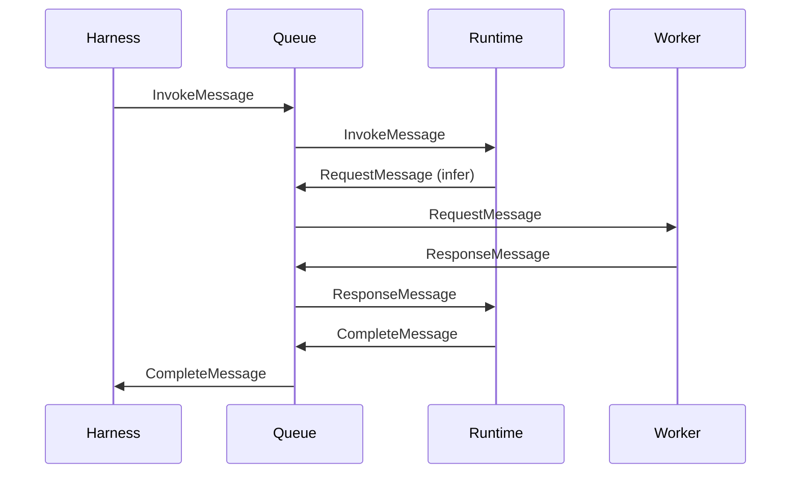

# Queue System

VlinderCLI uses a message queue as the universal communication layer between all components. This protocol-first design decouples components and enables transparent scaling.

## Why Queues?
Queues decouple producers from consumers. An agent doesn't need to know whether inference runs locally via Ollama or remotely via OpenRouter — it sends a message to the inference queue and gets a response. This abstraction lets VlinderCLI scale from a single process to a distributed cluster without modifying agent code.

## Message Types

All communication uses four typed messages:

| Message | Direction | Purpose |
|---------|-----------|---------|
| `InvokeMessage` | Harness → Runtime | Submit work to an agent |
| `RequestMessage` | Runtime → Service | Agent requests a service (inference, storage, etc.) |
| `ResponseMessage` | Service → Runtime | Service sends result back to agent |
| `CompleteMessage` | Runtime → Harness | Agent work is done (includes optional state hash) |

## Message Flow



## Service Routing
Each service type has a named queue. Workers poll their assigned queue and process messages:

| Service | Queue | Workers |
|---------|-------|---------|
| Inference | `infer` | `InferenceServiceWorker` |
| Embedding | `embed` | `EmbeddingServiceWorker` |
| Object Storage | `storage` | `ObjectServiceWorker` |
| Vector Storage | `storage` | `VectorServiceWorker` |

## Queue Backend

VlinderCLI uses [NATS](https://nats.io/) with JetStream for message durability. NATS handles both local and distributed deployments.

```toml
[queue]
backend = "nats"
nats_url = "nats://your-nats-server:4222"
```

## Scaling
Because all communication flows through the queue, scaling is straightforward: add more workers for the bottleneck service. Doubling Ollama inference workers doubles inference throughput with no code changes.

## See Also

- [Architecture](architecture.md) — component overview
- [Services](../reference/services.md) — service reference
- [Distributed Deployment](../how-to/distributed-deployment.md) — multi-process setup
