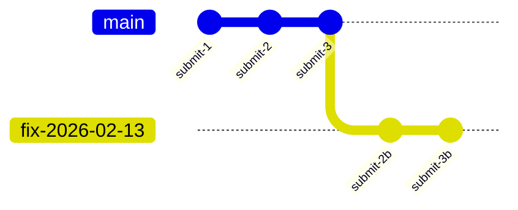

# Timelines

Timelines are VlinderCLI's mechanism for verifiable, forkable agent state. Every interaction produces a content-addressed hash that chains into an append-only Merkle DAG — making the full history immutable, inspectable, and replayable.

## Core Concepts

### Submissions
Each user input is a **submission**. The `SubmissionId` is a content-addressed SHA-256 hash of the payload, session, and parent submission — so identical inputs in the same context always produce the same ID. Processing a submission produces a chain of DAG nodes that capture every service interaction.

### Sessions
A **session** groups multiple submissions into a logical conversation. Each session is an island — its own independent Merkle chain with its own history. Sessions don't share state.

### Sequences
Within a single submission, service interactions (inference calls, storage operations) are ordered by **sequence** numbers. This ordering enables deterministic replay of the exact service call chain.

## The Merkle DAG

All agent side effects are tracked in a content-addressed Merkle DAG. Each DAG node incorporates:

- The parent node hash
- The message payload
- The message type and session context
- The agent's state hash (for complete messages)

This creates a verifiable chain — any tampering with intermediate state breaks the hash chain and is immediately detectable.

Agent data itself lives in the [storage workers](storage-model.md). The Merkle DAG doesn't store the data — it stores the hashes that make the data verifiable.

## Forking

Forking creates a new timeline from a historical node in a session's DAG:

After forking from `submit-2`, new submissions create a divergent path. The original history remains untouched. Storage state is restored to match the fork point — this is what makes time-travel debugging work for stateful agents.

Fork sends a `ForkMessage` through the queue, so all DAG projections react to it.

## Time Travel Workflow

See [Time Travel](time-travel.md) for the full explanation. The short version:

1. `vlinder session get <session-id>` — browse turns, identify where things went wrong
2. `vlinder session fork <session-id> --from <hash> --name <branch>` — create a timeline from a known-good turn
3. Continue the conversation on the new timeline
4. `vlinder session promote <branch>` — seal the old timeline, make the new one canonical

## Promote

After a successful fix, **promote** makes the new timeline canonical. It answers the question: "which timeline is the real one?"

Promote seals the old timeline and relabels it as `broken-YYYY-MM-DD` — nothing is deleted. The new branch becomes `main`. Both timelines continue to exist. The `broken-` timeline preserves the original history for auditing.

Because the DAG is content-addressed, timelines that share history before the fork point share the underlying nodes — no data is copied.

## Why a Merkle DAG?

The properties that make time travel possible — content addressing, append-only history, branching — are properties of Merkle DAGs. If you've used git, you already understand the data structure: nodes chain via parent hashes, and every node is content-addressed by SHA-256.

VlinderCLI stores the authoritative Merkle DAG in its DAG store. The [Conversations Repository](conversations-repo.md) is an optional read-only projection that writes each message as a git commit — so you can use `git log`, `git diff`, and standard git tooling to inspect the DAG. But the git repo is a visualization aid, not a system component.

## See Also

- [Time Travel](time-travel.md) — rewind, fork, and continue
- [Time-Travel Debugging](../how-to/time-travel-debugging.md) — practical workflows
- [State Store](state-store.md) — the versioned store that state hashes point into
- [Storage Model](storage-model.md) — how storage integrates with content addressing
- [Conversations Repository](conversations-repo.md) — the read-only git projection
