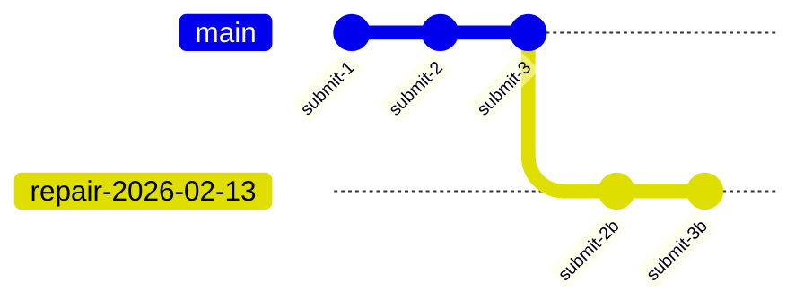

# Timelines

Timelines are VlinderCLI's mechanism for verifiable, forkable agent state. Every interaction produces a content-addressed hash that chains into an append-only Merkle DAG — making the full history immutable, inspectable, and replayable.

## Core Concepts

### Submissions
Each user input is a **submission**. Processing a submission produces a **state hash** — a Merkle DAG node that captures the complete state after all service interactions. The state hash chains to the previous one, forming a verifiable history.

### Sessions
A **session** (`ses-{uuid}`) groups multiple submissions into a logical conversation. Each session is a branch in the Merkle DAG.

### Sequences
Within a single submission, service interactions (inference calls, storage operations) are ordered by **sequence** numbers. This ordering enables deterministic replay of the exact service call chain.

## The Merkle DAG

All agent side effects are tracked in a content-addressed Merkle DAG. Each state hash incorporates:

- The previous state hash
- The submission content
- All service interaction results (ordered by sequence)

This creates a verifiable chain — any tampering with intermediate state breaks the hash chain and is immediately detectable.

Agent data itself lives in the [storage workers](storage-model.md) (SQLite). The Merkle DAG doesn't store the data — it stores the hashes that make the data verifiable.

## Forking

Forking creates a new branch from a historical node in the DAG:

After forking from `submit-2`, new submissions create a divergent path. The original history remains untouched. Storage state is restored to match the fork point — this is what makes time-travel debugging work for stateful agents.

The low-level `fork` command creates a branch at any commit. For the common case of debugging and fixing errors, the `checkout` + `repair` workflow (below) is the recommended path — it automates state restoration and enters the REPL in one step.

## Repair

**Repair** is the operational pattern for time-travel debugging: move HEAD to a known-good commit, branch off, restore agent state, and continue.

The workflow is:

1. `checkout` — moves HEAD to the target commit (detached). The commit's `State:` trailer records the agent's state hash at that point.
2. `repair` — creates a `repair-YYYY-MM-DD` branch from the detached HEAD, reads the `State:` trailer, restores the agent's state to that hash, and enters the REPL.

The repair branch is fully independent — the original timeline is untouched. You can have multiple repair branches from different points in the same timeline. Because git deduplicates objects, branches that share history share the underlying commits — no data is copied.

This pattern relies on the `State:` trailer that every complete message carries. Without it, the system wouldn't know which state to restore. The trailer is the link between the conversation history (git) and the agent's operational state (SQLite storage).

## Promote

After a successful repair, **promote** makes the repair branch canonical. It answers the question: "which timeline is the real one?"

Promote does three things:

1. Labels the old `main` as `broken-YYYY-MM-DD` — nothing is deleted
2. Moves `main` to the current HEAD
3. Switches to `main`

Both timelines continue to exist. The `broken-` branch preserves the original (erroneous) history for auditing or further inspection. Because commits before the fork point are shared, the storage cost of keeping both timelines is minimal — only the divergent commits are unique to each branch.

## Why Git?

VlinderCLI uses git as the Merkle DAG backend. Git's object model is itself a Merkle DAG — commits chain via parent hashes, and every object is content-addressed by SHA. Rather than building a custom Merkle DAG implementation, VlinderCLI uses one that already exists:

- **Content addressing** (SHA) — every state is uniquely identified
- **Branching** — forking is a native operation
- **Append-only history** — commits are immutable once written
- **Familiar tooling** — `git log`, `git diff`, and standard git tools work on the timeline repository

The timeline repository lives at `~/.vlinder/conversations/`. The `SubmissionId` is the git commit SHA. Sessions map to branches.

Git is the implementation detail, not the abstraction. The timeline API doesn't expose git concepts — it exposes submissions, sessions, and forks. A different Merkle DAG backend could replace git without changing the agent-facing interface.

## See Also

- [Time-Travel Debugging](../how-to/time-travel-debugging.md) — practical workflows
- [CLI: `vlinder timeline`](../reference/cli/timeline.md) — command reference
- [State Store](state-store.md) — the versioned SQLite store that State: trailers point into
- [Storage Model](storage-model.md) — how storage integrates with content addressing
